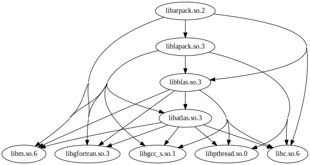
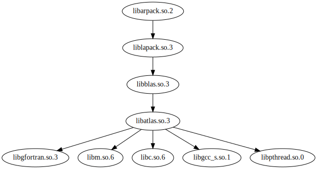

Plot [ELF](https://en.wikipedia.org/wiki/Executable_and_Linkable_Format) library dependencies using [graphviz](https://www.graphviz.org/).

ELF libraries declare dependencies on other ELF libraries. This tool extracts these dependencies using [`objdump`](https://en.wikipedia.org/wiki/Objdump) and writes a [dot](https://www.graphviz.org/doc/info/lang.html)-based representation of the dependency graph to stdout. This output can then be piped	 into graphviz's `dot` tool for conversion to svg or pdf etc.

An example of the output from this tool:



The same example, but simplified by a [transitive reduction](https://en.wikipedia.org/wiki/Transitive_reduction) from graphviz's [tred](https://manpages.debian.org/jessie/graphviz/tred.1.en.html) tool:



For more details on using the tool, run:

```
bin/elf-dependencies --help
```

To use this tool, you need to have the following installed:

* ruby
* objdump
* graphviz
